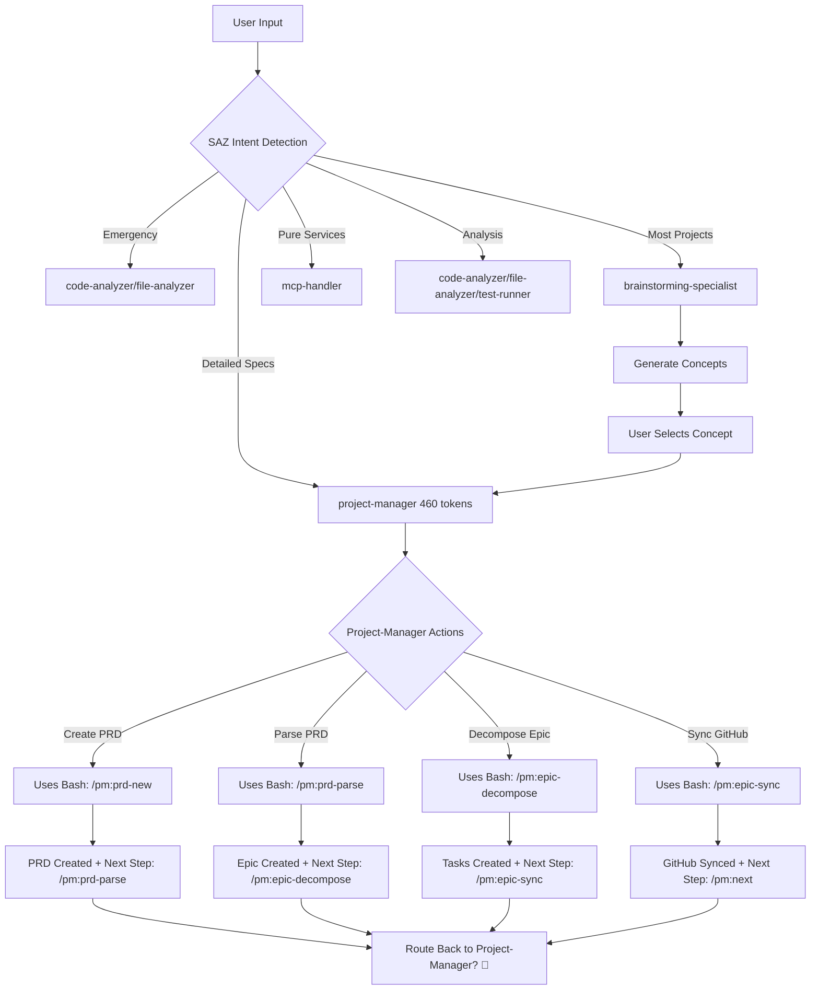
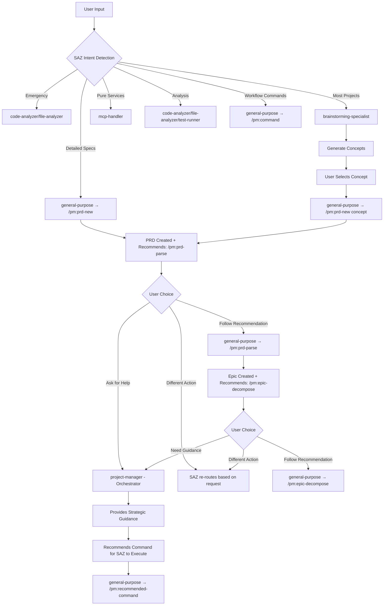
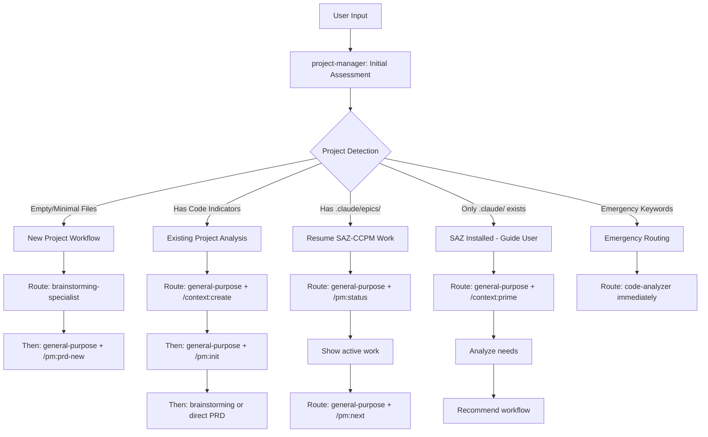

# SAZ-CCPM Workflow Analysis & Optimization

## 🔍 Current Workflow Logic Review

### Current Delegation Logic (CLAUDE.md)

```
User Input → SAZ Intent Detection → Agent Routing:

1. Emergency → code-analyzer/file-analyzer (immediate)
2. Most projects → brainstorming-specialist → project-manager  
3. Detailed specs → project-manager (can delegate to mcp-handler)
4. Pure services → mcp-handler
5. Analysis → code-analyzer/file-analyzer/test-runner
```

### Key Discovery: Custom Commands + Agent Integration

✅ **General-purpose agents CAN execute `/pm:` commands directly**
- Agents inherit access to `.claude/commands/` 
- Custom commands work seamlessly with agent delegation
- Each command provides built-in next step recommendations

## 📊 Current Workflow Diagram



## ❌ Current Problems Identified

### 1. **Inefficient Routing Loop**
- Every command completion routes back through project-manager (460 tokens)
- Commands already provide next step recommendations
- Project-manager becomes a expensive token bottleneck

### 2. **Command Execution Model Conflict**  
- Project-manager tries to execute commands via Bash
- But general agents can execute commands directly with less context
- Creates unnecessary complexity and token usage

### 3. **Context Bloat**
- Project-manager: 460 tokens per invocation
- General-purpose agent: ~50-100 tokens per invocation  
- 4-5x context overhead for routine command execution

## 💡 Optimized Workflow Design



## 🚀 REVISED APPROACH: Project-Manager as Initial Assessment Agent

### The New Role: Front-Door Triage & Routing

Instead of eliminating project-manager from the workflow, **position it as the essential startup agent** that:
1. **Assesses project state** (new vs existing, has .claude/, has code)
2. **Determines appropriate workflow** (brainstorming vs context creation vs resuming)
3. **Provides targeted routing** to general-purpose agents with specific commands
4. **Reduces SAZ's cognitive load** by handling initial logic and decision-making

### 📊 Project Detection Logic

```bash
# Efficient Project Detection (< 5 seconds)
PROJECT_INDICATORS=(
  "package.json"        # Node.js
  "requirements.txt"    # Python
  "setup.py"           # Python package
  "Cargo.toml"         # Rust
  "go.mod"             # Go
  "pom.xml"            # Java/Maven
  "build.gradle"       # Java/Gradle
  "Gemfile"            # Ruby
  "composer.json"      # PHP
  "*.csproj"           # C#/.NET
  "Makefile"           # C/C++ or general
  "CMakeLists.txt"     # CMake projects
)

CODE_DIRECTORIES=(
  "src/"
  "app/"
  "lib/"
  "test/"
  "tests/"
  "spec/"
  "public/"
  "static/"
  "assets/"
  "components/"
  "pages/"
  "api/"
)

# Quick assessment logic
if [[ -z "$(ls -A .)" || $(ls -A . | wc -l) -le 2 ]]; then
  PROJECT_STATE="empty"
elif [[ -f "package.json" || -f "requirements.txt" || -d "src" ]]; then
  PROJECT_STATE="existing_codebase"
elif [[ -d ".claude/epics" && -n "$(ls .claude/epics/)" ]]; then
  PROJECT_STATE="active_saz_work"
elif [[ -d ".claude" ]]; then
  PROJECT_STATE="saz_installed_only"
else
  PROJECT_STATE="new_project"
fi
```

### 📊 Scenario-Based Workflows



### 🎯 Specific Scenarios & Ideal Workflows

#### **Scenario 1: Brand New Project**
```
User: "I want to build a task management app"
SAZ: → project-manager (initial assessment)

Project-Manager Analysis:
- Empty directory ✓
- No .claude/ folder ✓
- No existing code ✓
- Vague requirements ✓

Response to SAZ:
"New project detected. Route to brainstorming-specialist for concept exploration.
After concept selection, use: general-purpose + /pm:prd-new [concept-name]"
```

#### **Scenario 2: Existing Codebase Detection**
```
User: "Help me add authentication to my app"
SAZ: → project-manager (initial assessment)

Project-Manager Quick Analysis (<5 seconds):
CHECK FOR PROJECT INDICATORS:
- package.json → Node.js project ✓
- requirements.txt/setup.py → Python project
- Cargo.toml → Rust project  
- go.mod → Go project
- pom.xml/build.gradle → Java project
- Gemfile → Ruby project
- composer.json → PHP project

CHECK FOR CODE STRUCTURE:
- src/, app/, lib/ directories ✓
- test/, tests/, spec/ directories
- public/, static/, assets/ directories
- .git/ directory (existing version control)

ASSESS COMPLEXITY:
- File count in src/: 47 files
- Appears to be: React application with Express backend

Response to SAZ:
"I see you're working on a React/Express project that looks quite established.
Before we add authentication, I suggest:
1. Run: general-purpose + /context:create (analyze current architecture)
2. This will help understand your existing patterns
3. Then we can add authentication that fits your project style

Would you like me to analyze the codebase first, or proceed directly with auth planning?"
```

#### **Scenario 3: Returning to SAZ-CCPM Project**
```
User: "Continue working on the dashboard"
SAZ: → project-manager (initial assessment)

Project-Manager Analysis:
- Has .claude/epics/dashboard/ ✓
- Has active PRD ✓
- Has incomplete tasks ✓

Response to SAZ:
"Active SAZ-CCPM project detected.
1. Run: general-purpose + /pm:status (show current state)
2. Run: general-purpose + /pm:next (get next task)
3. Or: general-purpose + /pm:epic-show dashboard (see all tasks)"
```

#### **Scenario 4: Stale Project Revival**
```
User: "What was I working on?"
SAZ: → project-manager (initial assessment)

Project-Manager Analysis:
- Has .claude/CLAUDE.md ✓
- Has .claude/context/ ✓
- No active epics ✗
- Old timestamps ✓

Response to SAZ:
"Dormant SAZ-CCPM project detected.
1. Run: general-purpose + /context:prime (reload project understanding)
2. Run: general-purpose + /pm:prd-list (see all PRDs)
3. Recommend: Choose a PRD to continue or start new feature"
```

#### **Scenario 5: SAZ Installed But No Project**
```
User: "Create a todo app with React"
SAZ: → project-manager (initial assessment)

Project-Manager Analysis:
- .claude/ directory exists ✓
- No package.json ✗
- No src/ directory ✗
- Only 3 files total (mostly .claude/)
- Essentially empty project

Response to SAZ:
"I see SAZ-CCPM is installed but no project started yet.
Since you want a React todo app, let's explore the best approach:
1. Route to: brainstorming-specialist (explore todo app concepts)
2. We can consider: traditional todo, kanban-style, team collaboration, etc.
3. After concept selection: general-purpose + /pm:prd-new [concept-name]

Or if you have a clear vision, we can skip to PRD creation directly."
```

#### **Scenario 6: Emergency Situation**
```
User: "Production is down! Payment processing broken!"
SAZ: → project-manager (initial assessment)

Project-Manager Analysis:
- Emergency keywords detected ✓
- "down", "broken" ✓

Response to SAZ:
"🚨 EMERGENCY DETECTED
Skip all workflows.
Route immediately to: code-analyzer
Focus: payment processing systems"
```

## 🎯 Original Recommendations (Now Secondary)

### 1. **Transform Project-Manager Role** (REVISED - See Above)

**CURRENT**: Command Executor (460 tokens, tries to run Bash)
```
project-manager:
- tools: Bash, Read, Write, Glob
- description: "Executes commands, manages phases"  
- behavior: Attempts direct command execution
```

**RECOMMENDED**: Strategic Orchestrator (200 tokens, guidance only)
```  
project-manager:
- tools: Read, Write (remove Bash)
- description: "Workflow orchestrator - provides strategic guidance when users need direction"
- behavior: Analyzes situation, recommends commands for SAZ to execute
```

### 2. **Update Delegation Logic**

**CURRENT**: 
```
Most projects → brainstorming-specialist → project-manager
Detailed specs → project-manager  
```

**RECOMMENDED**:
```
Most projects → brainstorming-specialist → general-purpose + /pm:prd-new
Detailed specs → general-purpose + /pm:prd-new
Workflow help → project-manager (orchestrator)
Command execution → general-purpose + /pm:command
```

### 3. **Smart Routing Triggers for Project-Manager**

Only route to project-manager when:
- ❓ **User asks for help**: "what should I do next?", "I'm confused", "help"
- 🔄 **User breaks workflow**: Does something other than recommended next step
- 📊 **Status requests**: "what's my progress?", "show me status"  
- 🧭 **Strategic decisions**: "should I approach this differently?"
- ⚠️ **Blockers/issues**: "I'm stuck", "this isn't working"

### 4. **Efficient Command Execution Pattern**

```
User: "Create PRD for user-authentication"
SAZ: → general-purpose agent → /pm:prd-new user-authentication
Agent: Executes command, creates PRD, shows: "✅ Ready for: /pm:prd-parse user-authentication"

User: "Yes, continue" (or just runs the command)  
SAZ: → general-purpose agent → /pm:prd-parse user-authentication
Agent: Creates epic, shows: "✅ Ready for: /pm:epic-decompose user-authentication"

User: "Actually, I want to see the status first"
SAZ: → general-purpose agent → /pm:status
Agent: Shows status

User: "I'm not sure what to prioritize next"
SAZ: → project-manager (orchestrator)
Agent: Analyzes project state, recommends: "Focus on X first. Run: /pm:epic-decompose user-authentication"
```

## 📈 Efficiency Gains

### Token Reduction:
- **Current**: 460 tokens per project-manager call
- **Optimized**: ~100 tokens per general-purpose + command call
- **Savings**: ~75% context reduction for routine operations

### User Experience:
- **Faster execution** (less context processing)
- **Natural flow** (commands guide to next steps)
- **Help available** (project-manager when needed)
- **Less interruption** (smooth command sequences)

### Developer Benefits:
- **Clear separation** (execution vs orchestration)  
- **Maintainable** (commands handle their own logic)
- **Extensible** (add new commands without agent changes)
- **Debuggable** (easier to trace execution paths)

## 🔄 Migration Strategy

### Phase 1: Transform Project-Manager
1. Remove Bash tool from project-manager
2. Update description to "Strategic Orchestrator"  
3. Change response patterns to guidance-only
4. Test orchestration without execution

### Phase 2: Update Delegation Logic  
1. Route workflow commands to general-purpose agents
2. Reserve project-manager for guidance scenarios
3. Update CLAUDE.md delegation patterns
4. Test new routing logic

### Phase 3: Optimize Command Flow
1. Let commands provide natural next step recommendations
2. Route to project-manager only when help needed
3. Streamline common workflow sequences  
4. Validate efficiency improvements

## ✅ Expected Outcomes

- **75% reduction** in context usage for routine workflows
- **Faster command execution** through direct agent access
- **Natural workflow progression** guided by command recommendations
- **Expert guidance available** when users need strategic direction
- **Maintainable architecture** with clear separation of concerns

**Key Insight**: Commands are self-guiding, project-manager should orchestrate strategy, not execute tactics.